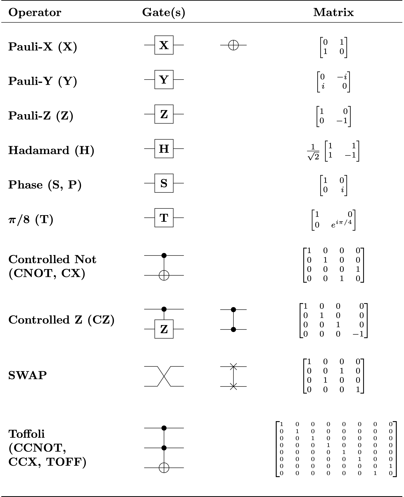
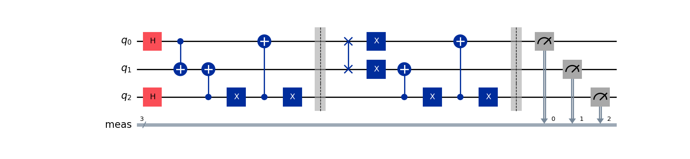

# quantum
quantum mechanics experiments


Quantum Gate Operations

### Rotation Gates

- X: NOT gate (\+) : Rotates the state to its opposite, equivalent to a 180° rotation around the X axis.
- Z: Rotates the state 180° around the Z axis, modifying the phase of the qubit. (modifies the phase of the qbit)
- H (Hadamard): Applies a 180° rotation around the axis between X and Z, transforming a qubit from a state 0 into
  a superposition of states (e.g., 0 and 1).  Same works if the initial state was 1

### Particularities

- |O>: Applying the same operation twice returns the system to its original state.
- Z and H: Similar behavior to +.

### Other Gates

- Ry: Rotates around the Y axis by 45° or 90°.
- CNOT (Controlled NOT): Modifies the state of the target qubit based on the control qubit.
  - if qbit is in 0 state, non operation is applied to the target qbit
  - if qbit is in 1 sate, an NOT gate is applied (+)
- CH gate: (same)
- CZ gate: (same)
- CCNOT: Control-control not gate also known as Toffoli gate. The 2 control qbits must be in state 1 to apply the not
- SWAP gate: changes the state between the control and target qbit




### Entanglement 
when 2 qbits are entangled they are linked together. Measuring one qbit determines the measurement of the other.
- e.g: if 2 qbits are entangled in a superposition of |00> and |11> its impossible to say whats the value of the first qbit's
measurement would be, but once measured we know the value of the other 
- To entangle two qbits on a quantum computer we need to put the first qbit in a superposition (H) and apply a CNOT gate as
a control one

```text
q0 ---- (H) ---------
                  |
q1 ---------- (CNOT(+)) ---
```


# The Treasure Door Game



```python
import from qiskit import QuantumCircuit
treasure_door = QuantumCircuit(3)
treasure_door.h(0)
treasure_door.h(2)
treasure_door.cx(0,1)
treasure_door.cx(2,1)
treasure_door.x(2)
treasure_door.cx(2,0)
treasure_door.x(2)
treasure_door.barrier(range(3))
treasure_door.swap(0,1)
treasure_door.x(0)
treasure_door.x(1)
treasure_door.cx(2,1)
treasure_door.x(2)
treasure_door.cx(2,0)
treasure_door.x(2)
treasure_door.measure_all()
```